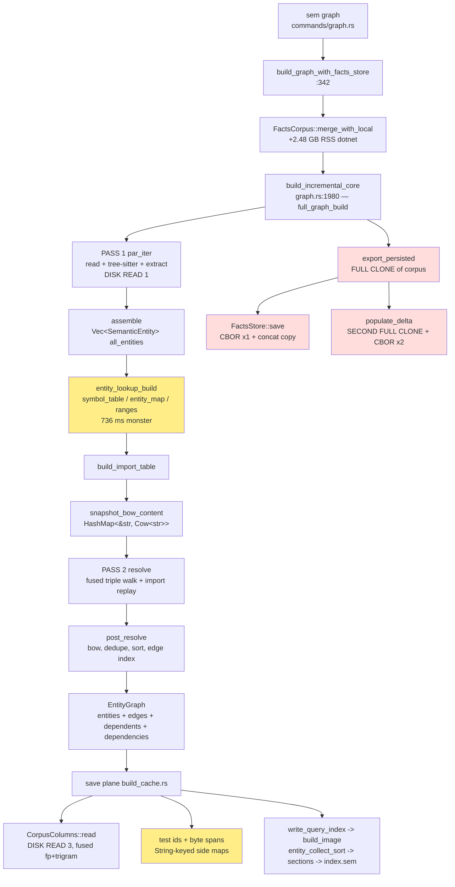

# DATA-FLOW-AUDIT: the cold-build callgraph, and the flows that should not exist

Bead: semx-hkr. Epic: semx-w5k. HEAD: `c655b7e`.

The instrument for this audit is **sem's own release binary, run on the sem
repository**. Every callgraph edge below was found with `sem find` / `sem
callers` / `sem refs` / `sem context` / `sem impact` first; `Read`/`grep` was
used only to read bodies sem pointed at, and to verify the two places sem's
answer was wrong (both recorded in §5, which is the point of dogfooding).

Phase costs are annotated from `RESOLUTION-PROFILE.md`'s tables (W0 §2, W5 §2,
and the LOCAL-COLD series) plus this bead's own two profiled runs on the sem
repo itself. Nothing here changes production code — the deliverable is the
graph and the ranked audit.

---

## 0. sem-on-sem: the dogfood datapoint

`cargo build --release -p sem-cli` (warm, 0.18 s), binary at
`crates/target/release/sem`, run on `/Users/palanikannan/Documents/work/ataraxy/sem`.

**Corpus**: 6,279 entities, 8,478 edges, 222 supported files (185 of them on the
scope-resolve AST path), 171 `.rs` files. A medium Rust repo, retain path
(222 ≪ `PARSED_FILE_REUSE_LIMIT` = 20,000), single chunk.

| run | total | file_discovery | full_graph_build | index_only_save | serialization |
|---|---:|---:|---:|---:|---:|
| true cold (fresh `SEM_CACHE_DIR`, `SEM_FACTS_CACHE=0`) | **212.7 ms** | 4.6 | 180.8 | 26.9 | 0.45 |
| cold w/ facts plane on | **309.1 ms** | 11.1 | 249.9 | 46.9 | 1.11 |
| warm (existing cache) | **317.6 ms** | 7.2 | 241.6 | 29.1 | 0.23 |

Verbs all answer. `find`/`callers`/`refs`/`context`/`impact` on this index are
sub-10 ms each and served from `index.sem`.

**`SEM_PROFILE_RESOLVE=2`** (thread-summed ms):

```
FRAME       pass1_wall 76.90  assemble 0.64  scope_wall 80.86  post_resolve 21.16
SCOPE_BUILD total 176.14 = fused_walk 161.03 + entity_spans 7.51 + extract_imports 4.14
                           + inject_return_types 0.78 + import_rekey 0.23 + residual 1.78
            work: files_ast 185, files_precomputed 0, entities_spanned 4,905,
                  scopes_built 4,594, refs_collected 38,888
BOW         index_tokenize 204.14  index_build 204.20  resolve 18.29  wall 17.11
IMPORT_TBL  wall 5.79  scan 66.28  io 2.10  merge 0.26
LOOKUP      owned 10.81  child_ranges 8.49  pass_a 0.35  pass_b 0.24  (entity_lookup_build 11.40)
RESIDUAL    edge_index 1.39  sort 1.51  dedupe 0.40  symbol_table_by_file 0.65
```

**`SEM_PROFILE_CACHE=1`** (wall ms):

```
facts_local_load 0.03  facts_corpus_merge 36.57  facts_export_persisted 3.81
facts_store_save 9.24  facts_corpus_populate_delta 57.60
corpus_columns_single_read 26.09  dir_fingerprints 0.79
INDEX_IMAGE: entity_collect_sort 9.95  refs_section 9.34  trigram_section 11.44
             names_section 3.53  entities_section 2.89  file_and_entity_index 0.78
FACTS_RSS: entry 13.2 MB -> after_corpus_merge 22.3 -> after_warm_start 248.1
           -> after_export_persisted 256.3 -> after_populate_delta 306.1 MB
```

Two things jump out of a 200 ms build and both reappear at giant scale:
`facts_corpus_populate_delta` (57.6 ms) is **6.2× `facts_store_save`** and
**15× `facts_export_persisted`** on a corpus with `hits=0`; and
`entity_collect_sort` (9.95 ms, 1.58 µs/entity) is the largest non-trigram
index-image phase. Both are findings D1 and D6 below.

`FACTS_CORPUS probed=222 hits=0 shards_read=195 bytes_read=0` — 36.6 ms to open
195 shards and read zero bytes. On a giant that is 1,024 shards.

---

## 1. The callgraph, hot path only

Annotated with `file:line`, the measured phase, what enters and what leaves.
Cold branches (warm/incremental `carry`, session rebuild, cloud tier, diff) are
deliberately not mapped — the phase timers say the cold build never enters them.

### 1.1 Compact ASCII

```
sem graph <root>                                     sem-cli/src/commands/graph.rs
│
├─ file_discovery ................................... 4.6 ms (sem) | 140 ms (HA) | 2,045 (linux)
│    ignore::WalkBuilder -> Vec<String> file_paths
│
├─ build_graph_with_facts_store                       commands/graph.rs:342
│  │   in:  &[String] file_paths, &ParserRegistry
│  │   out: (EntityGraph, Vec<SemanticEntity>)
│  │
│  ├─ FactsStore::load ............................. 0.03 ms (sem) — Option<PersistedFacts>
│  ├─ FactsCorpus::merge_with_local ................ 36.6 (sem) | 583 monster-known | 827-867 dotnet-known
│  │     in:  file_paths, Option<&PersistedFacts>       RSS: +2,475.6 MB on dotnet [w5k §5]
│  │     out: PersistedFacts (decoded CBOR, held live)
│  │
│  ├─ GraphSession::warm_start | ::build           session.rs
│  │  └─ EntityGraph::build ....................... graph.rs:1961 -> :1980
│  │     └─ build_incremental_core                 graph.rs:1980  [full_graph_build]
│  │        │   in:  root, &[String] file_paths, &ParserRegistry, carry=None
│  │        │   out: (EntityGraph, Vec<SemanticEntity>)
│  │        │
│  │        ├─ PASS 1  par_iter over file_paths ... pass1_wall 76.9 (sem)
│  │        │  │  graph.rs:2018-2131
│  │        │  ├─ fs::read_to_string ............. DISK READ #1 -> String content
│  │        │  ├─ registry.extract_entities[_with_tree]   registry.rs:256/290
│  │        │  │     content -> tree_sitter::Tree -> Vec<SemanticEntity>
│  │        │  └─ scope_resolve::precompute_js_ts_file_facts   (JS/TS only)
│  │        │        tree -> PrecomputedFileFacts {scopes, entity_scope_map,
│  │        │                                      entity_inner_scope, ast_refs, content}
│  │        │  out: Vec<Pass1FileProduct>
│  │        │
│  │        ├─ ASSEMBLE ........................... assemble 0.64 (sem)   graph.rs:2134-2188
│  │        │     Vec<Pass1FileProduct> -> Vec<SemanticEntity> all_entities  (file-path order)
│  │        │                            -> Vec<(String,String,Tree)> parsed_files
│  │        │                            -> HashMap<String,PrecomputedFileFacts>
│  │        │
│  │        ├─ resolve_go_method_parent_ids ....... graph.rs:2285 (no-op off Go)
│  │        │
│  │        ├─ PRE_RESOLVE / entity_lookup_build .. 11.40 (sem) | 736.61 monster [4an §inventory]
│  │        │  ├─ Pass A (borrowed, rayon::join×3)  graph.rs:2334-2383   pass_a 0.35
│  │        │  │     &all_entities -> parent_child_pairs, class_child_names,
│  │        │  │                      child_line_ranges, class_entity_names, class_entity_files
│  │        │  ├─ Pass owned .................... graph.rs:2427-2522   owned 10.81   >>> D4
│  │        │  │     &all_entities -> symbol_table   HashMap<String,Vec<String>>
│  │        │  │                   -> entity_map     HashMap<String,EntityInfo>
│  │        │  │                   -> entity_ranges  HashMap<String,Vec<(usize,usize,String)>>
│  │        │  │                   -> class_members / owner_members
│  │        │  │     + sort_symbol_table_targets_by_source, sort_all_member_buckets_by_source
│  │        │  │     + build_child_ranges_by_parent    child_ranges 8.49
│  │        │  ├─ Pass B (borrowed) ............. graph.rs:2532-2547   pass_b 0.24
│  │        │  │     -> enclosing_class, class_members: HashMap<&str,_>
│  │        │  └─ go_pkg_index (gated on any .go)  graph.rs:2554-2593
│  │        │
│  │        ├─ build_import_table ................. graph.rs:5457   scan 66.28 thread-ms (sem)
│  │        │     in:  file_paths, &symbol_table, &entity_map, Option<&parsed_files>
│  │        │     out: HashMap<(String,String),String>   (file,name) -> target id
│  │        │
│  │        ├─ snapshot_bow_content ............... graph.rs:1503   bow_precompute 0.46 (sem)   >>> D9
│  │        │     in:  &parsed_files, &precomputed_facts
│  │        │     out: HashMap<&str, Cow<str>>   (Owned for parsed_files, Borrowed for facts)
│  │        │
│  │        ├─ PASS 2 / resolve ................... scope_wall 80.86 (sem)
│  │        │  │  graph.rs:2823-2857
│  │        │  ├─ [retain, files<=20k] scope_resolve::resolve_with_scopes_full   scope_resolve.rs:861
│  │        │  └─ [chunked]            resolve_scopes_in_file_chunks             graph.rs:1528
│  │        │     │    chunk_files_by_byte_budget (20 MB source/chunk)  graph.rs:263
│  │        │     │    PrebuiltEntityIndex::build  (hoisted, semx-6rd CUT2)
│  │        │     │    OnceLock top_level_entities / py_top_level_entities (hoisted, semx-la2)
│  │        │     └─ scope_resolve::resolve_with_scopes_full_chunked -> _inner  scope_resolve.rs:1009/1235
│  │        │        │   scope_build: sem 176.14 | HA 7,663 | dotnet 17,748 | linux 4,447 | monster 321
│  │        │        ├─ fused triple walk .............. sem 161.03 (91% of the box)
│  │        │        │     one tree walk -> scopes, entity_scope_map,
│  │        │        │                      entity_inner_scope, Vec<AstRef>, import-record set R
│  │        │        │     (semx-3ao: 1.18-1.24× one walk, for three walks' output)   >>> D10
│  │        │        ├─ pruned import replay + handlers  sem 4.14 | HA 2,518 | linux 3,935
│  │        │        │     R -> import_table mutations, scopes[0].defs
│  │        │        └─ resolve_ref / ref_loop -> Vec<(String,String,RefType)> edges
│  │        │
│  │        ├─ POST_RESOLVE ....................... post_resolve 21.16 (sem)
│  │        │  ├─ build_imports_by_file / build_symbol_table_by_file  graph.rs:1196/1239
│  │        │  ├─ resolve_references_with_file_indexes (bag-of-words)  graph.rs:1292
│  │        │  │   │  bow_wall 17.11, index_build 204.20 thread-ms, tokenize 204.14, resolve 18.29
│  │        │  │   ├─ build_file_reference_index   graph.rs:1453
│  │        │  │   │     pre_parsed_content.get(path) -> Cow::Borrowed
│  │        │  │   │     else fs::read_to_string  <- DISK READ #2 (non-JS/TS, chunked path only)
│  │        │  │   │     -> strip_for_language -> FileReferenceIndex
│  │        │  │   └─ resolve_entity_references    graph.rs:1637 -> Vec<(String,String,RefType)>
│  │        │  ├─ build_export_alias_edges         graph.rs:4769
│  │        │  ├─ dedupe_resolved_edges ........... graph.rs:829   dedupe 0.40 (sem)   >>> D8
│  │        │  ├─ sort_resolved_refs (par_sort_by)  graph.rs:849   sort 1.51
│  │        │  └─ edge index loop ................. graph.rs:2997  edge_index 1.39     >>> D7
│  │        │        Vec<(String,String,RefType)> -> Vec<EntityRef> edges
│  │        │                                     + dependents:  HashMap<String,Vec<String>>
│  │        │                                     + dependencies:HashMap<String,Vec<String>>
│  │        └─ EntityGraph { entities: entity_map, edges, dependents, dependencies }
│  │
│  ├─ GraphSession::export_persisted .............. 3.81 ms (sem)  session.rs:478      >>> D2
│  │     in:  &self (all_entities, precomputed, resolution, entity_spans)
│  │     out: PersistedFacts — a FULL DEEP CLONE of the corpus
│  ├─ FactsStore::save ............................ 9.24 (sem) facts_store.rs:384     >>> D3
│  │     &PersistedFacts -> Vec<Vec<u8>> shard CBOR -> Vec<u8> bytes -> tmp -> rename
│  └─ FactsCorpus::populate_delta ................. 57.60 (sem) facts_store.rs:1485   >>> D1
│        &PersistedFacts -> Vec<CorpusFile> (SECOND full clone) -> write_corpus_files
│
└─ SAVE PLANE                                        sem-cli/src/build_cache.rs
   │  index_only_save 26.9 (sem) | HA ~880 ms [la2 §5]
   ├─ CorpusColumns::read ......................... corpus_columns_single_read 26.09 (sem)
   │     DISK READ #3 (par_iter) -> FileFingerprint (xxh3) + per-file trigram sets, fused
   ├─ filter_test_entities_with_custom_dirs ....... graph.rs:4353 -> HashSet<String>   >>> D5
   ├─ entity_byte_spans ........................... build_cache.rs -> HashMap<String,(u32,u32)>  >>> D5
   └─ write_query_index ........................... build_cache.rs:195
      ├─ build_dir_fingerprints .................... 0.79 (sem)
      └─ index::build_with_trigrams_and_dirs_and_tests_and_spans   index/writer.rs:330 -> build_image:350
         ├─ entity_collect_sort ..................... 9.95 (sem)  writer.rs:360-369    >>> D6
         │     graph.entities.values() -> Vec<&EntityInfo> -> par_sort_unstable_by 6 keys
         ├─ file_and_entity_index 0.78, entities_section 2.89 (2 hash lookups/entity)  >>> D5
         ├─ names_section 3.53, files_and_kinds 0.40
         ├─ refs_section 9.34   (built from `edges`, NOT from dependents/dependencies)
         └─ trigram_section 11.44 -> Vec<u8> -> index::write_atomic
```

### 1.2 Mermaid



---

## 2. The plain-dumb audit, ranked by estimated yield

Estimates are labelled **[measured]**, **[scaled]** (this bead's per-unit rate
from the sem repo × the giant's unit count — an estimate, not a measurement) or
**[bounded]** (an upper bound from a published phase total).

---

### D1 — `populate_delta` deep-clones the entire corpus to hand it to a serializer
**DUMB-REMOVE** · category (a) same structure built twice + (e) lifetime sloth
`crates/sem-core/src/parser/facts_store.rs:1491-1506`

```rust
.map(|f| {
    let lang_id = detect_language_id(&f.facts.path, registry);
    CorpusFile {
        facts: f.facts.clone(),              // every SemanticEntity, bodies included
        precomputed: f.precomputed.clone(),  // incl. the file's entire content String
        lang_salt: effective_language_salt(&lang_id),
    }
})
.collect();
self.write_corpus_files(changed)
```

**The flow in one sentence.** `PersistedFacts` — already a complete second copy
of the corpus (see D2) — is cloned a *third* time into `Vec<CorpusFile>` whose
only consumer is `write_corpus_files`, which buckets it and CBOR-encodes each
entry.

**Why it exists.** `CorpusFile` is one type doing two jobs: it is the
`Deserialize` target for a shard read *and* the `Serialize` source for a shard
write. The read side genuinely needs owned data; the write side never does.
On a true-cold build `previous` is `None`, so the filter at :1495 passes 100% of
files and the clone is total.

**Yield.** `RESOLUTION-PROFILE.md` semx-w5k §5 localizes
`export_persisted -> save -> populate_delta` at **+4,852.1 MB of RSS on
dotnet-runtime** [measured]; this clone is one of the three copies in that band.
Wall: `facts_corpus_populate_delta` is 57.60 ms on the sem repo against 9.24 ms
for `facts_store_save` over the same data [measured] — a 6.2× ratio that is
almost entirely the clone, since the two do the same CBOR work; W5/fqh's giant
numbers are 353-370 ms (monster, known) and 466-560 ms (dotnet, known)
[measured], and a true-cold build clones every file rather than the delta.
Estimate: **~1.5-2.5 GB of RSS and ~150-350 ms of wall on dotnet/linux**
[scaled from the ratio], zero risk.

**Fix shape.** A `#[derive(Serialize)] struct CorpusFileRef<'a> { facts:
&'a FileFacts, precomputed: Option<&'a PrecomputedFileFacts>, lang_salt: &'a str }`
and `write_corpus_files` taking `Vec<(u64, CorpusFileRef<'_>)>`. serde encodes
`&T` byte-identically to `T`, so the shard bytes are unchanged — which the
existing `facts_corpus_probe` 2/2 oracle and
`lookup_bytes_do_not_grow_with_unrelated_corpus_content` already gate.

---

### D2 — `export_persisted` materialises a full second copy of the corpus so two savers can borrow it
**DUMB-REMOVE** · category (a) + (e)
`crates/sem-core/src/parser/session.rs:478-493`

```rust
entities: self.all_entities[*start..*start + *len].to_vec(),
...
precomputed: self.precomputed.get(path).cloned(),
resolution:  self.resolution.get(path).cloned(),
```

**The flow.** Every `SemanticEntity` (including its `content` body String),
every `PrecomputedFileFacts` (including the file's whole source text) and every
`CachedFileResolution` is deep-cloned out of the live session into
`PersistedFacts`, which is then only ever passed as `&PersistedFacts` to
`store.save` and `corpus.populate_delta` (`commands/graph.rs:405-417`) before
being dropped — while `session` is still alive and still owns the originals.

**Why it exists.** `PersistedFacts` is the *deserialize* type (`FactsStore::load`
returns it, `warm_start` consumes it by value). Reusing it as the export shape
was the shortest path from "we can load facts" to "we can save facts"; the
function's own doc comment names the cost ("Building it copies entity bodies and
cached edges") but treats it as inherent rather than as an artifact of type
reuse.

**Yield.** Part of the same **+4,852.1 MB on dotnet** band [measured]. On the
sem repo, RSS steps 248.1 → 256.3 MB across `export_persisted` alone (+8.2 MB on
a 6,279-entity corpus, ≈1.3 KB/entity) [measured]; at dotnet's 990,654 entities
that scales to **~1.3 GB** [scaled]. Wall is small (3.81 ms on sem) — the win
here is memory, and memory is what makes dotnet's peak 19.9 GB.

**Fix shape.** A borrowed `PersistedFactsRef<'a>` used by the two save call
sites; owned `PersistedFacts` retained for load/warm_start. D1 and D2 are one
change, not two — do them together or neither.

---

### D3 — `FactsStore::save` holds every shard's CBOR twice
**DUMB-REMOVE** · category (b) built then immediately reshaped
`crates/sem-core/src/parser/facts_store.rs:394-422`

```rust
let shard_bytes: Option<Vec<Vec<u8>>> = maybe_par_iter!(chunks).map(...).collect();
...
let mut bytes = Vec::with_capacity(MAGIC.len() + 4096);
for shard in &shard_bytes {
    write_u64_le(&mut bytes, shard.len() as u64);
    bytes.extend_from_slice(shard);      // <- second full copy of all CBOR
}
let write_result = std::fs::write(&tmp, &bytes).and_then(|()| std::fs::rename(&tmp, &path));
```

**The flow.** Every shard is encoded into its own `Vec<u8>` (correctly, in
parallel), then all of them are memcpy'd into one contiguous `Vec<u8>` purely so
a single `fs::write` can be called. Both live simultaneously; `Vec::with_capacity(4096)`
means the concatenation also pays a full re-allocation ladder.

**Why it exists.** `fs::write` + `rename` is the atomic-write idiom the file
uses everywhere. Nobody needed the bytes contiguous — only durable.

**Yield.** One full copy of the encoded facts, held at peak. Part of the same
+4.85 GB band [bounded]. On dotnet the facts blob is multi-GB; **~1-2 GB of peak
RSS** [scaled], plus the memcpy wall.

**Fix shape.** `BufWriter<File>` on the tmp path: write MAGIC, header, fingerprints,
count, then each shard's length+bytes in order; `flush` + `rename`. Byte-identical
output, same atomicity, `shard_bytes` can even be consumed as it is written.

---

### D4 — the cold whole-rebuild allocates ~10 Strings per entity, and the same function already knows the cheap idiom
**DUMB-REMOVE** (the `entry(k.clone())` half) / **NEEDS-MEASUREMENT** (the `EntityInfo` half)
category (c) String churn + (a)
`crates/sem-core/src/parser/graph.rs:2433-2454`

```rust
for entity in &all_entities {
    symbol_table_owned.entry(entity.name.clone()).or_default().push(entity.id.clone());
    owned_entity_map.insert(entity.id.clone(), EntityInfo {
        id: entity.id.clone(), name: entity.name.clone(),
        entity_type: entity.entity_type.clone(), file_path: entity.file_path.clone(),
        parent_id: entity.parent_id.clone(), start_line: .., end_line: ..,
    });
    owned_entity_ranges.entry(entity.file_path.clone()).or_default()
        .push((entity.start_line, entity.end_line, entity.id.clone()));
}
```

Per entity, on the cold path: 10 `String` allocations, of which **two
(`entity.name.clone()` and `entity.file_path.clone()` as `entry` keys) are
allocated and immediately dropped on every hit** — `HashMap::entry` demands an
owned key eagerly. `file_path` in particular repeats once per entity in the
file, so on a 60-entity file it is allocated 60 times and kept once.

**Why it exists.** Nothing deliberate — and the proof is 80 lines above, at
`graph.rs:2349-2354`, where the *same function* builds `child_line_ranges` with
the correct idiom:

```rust
match child_line_ranges.get_mut(pid.as_str()) {
    Some(bucket) => bucket.push(...),
    None => { child_line_ranges.insert(pid.clone(), vec![...]); }
}
```

Two loops in one function, one paying the eager-key tax and one not. That is
drift, not design.

**Yield.** `entity_lookup_build_ms` = **736.61 ms on the TypeScript monster**
(454,541 entities) [measured, semx-4an inventory] = 1.62 µs/entity. This bead
measures 11.40 ms on 6,279 entities = **1.72 µs/entity** on a completely
different corpus and language [measured] — the rate is stable, and `owned_ms`
(10.81 of 11.40) is essentially the whole bucket. Scaled: dotnet 990,654 →
**~1.6 s**, linux 2,312,433 → **~3.7 s** [scaled]. Killing just the two eager
`entry` keys is behaviour-identical and removes 2 of 10 allocations plus every
hit's free: **~0.3 s on dotnet, ~0.7 s on linux** [scaled], for a ~10-line diff.

The `EntityInfo` half — five more String clones per entity to build a lossy
projection of a `SemanticEntity` that stays alive for the whole build — is worth
more but changes `EntityGraph::entities`' public type. See D5: the save plane
then has to *undo* this projection.

---

### D5 — the save plane rebuilds two String-keyed side maps to re-attach data `SemanticEntity` never lost
**DUMB-REMOVE** (key type) / **NEEDS-MEASUREMENT** (the rejoin itself)
category (a) + (b) + (c)
`crates/sem-cli/src/build_cache.rs` (`entity_byte_spans`), `crates/sem-core/src/parser/graph.rs:4353-4365`, consumed at `crates/sem-core/src/index/writer.rs:417-424`

```rust
// build_cache.rs — producer
fn entity_byte_spans(entities: &[SemanticEntity]) -> HashMap<String, (u32, u32)> {
    entities.iter().filter_map(|e| Some((e.id.clone(), (start, end)))).collect()
}
// graph.rs:4353 — producer
for entity in entities { if is_test_entity(entity, dirs) { test_ids.insert(entity.id.clone()); } }

// writer.rs:417 — consumer, per entity, over graph.entities.values()
let flags = match test_entity_ids { Some(ids) if ids.contains(&entity.id) => FLAG_IS_TEST, _ => 0 };
let (start_byte, end_byte) = entity_byte_spans.and_then(|spans| spans.get(&entity.id))...;
```

**The flow.** `&[SemanticEntity]` → two owned `String`-keyed collections (2
String clones per entity) → handed straight into `build_image`, which iterates
`graph.entities.values()` (`EntityInfo`, a *different* struct) and re-joins by
hashing the entity id string **twice per entity**.

**Why it exists.** `EntityInfo` (D4) dropped `start_byte`/`end_byte`/`content`.
The index needs them. Rather than widen `EntityInfo` or pass the entities, two
side maps were added — `entity_byte_spans`' own doc comment even cites
`test_entity_ids` as the precedent ("the same shape `test_entity_ids` established
for a datum the writer needs"), so the second one was modelled on the first.
The projection at D4 and the rejoin here are the same mistake, twice.

**Yield.** 2 String allocations + 2 string hashes per entity, all avoidable.
`entities_section` is 2.89 ms on 6,279 entities [measured]; the two producers are
inside `save_with_test_dirs`/`write_index_only` and unattributed. At linux's
2,312,433 entities that is **4.6 M allocations + 4.6 M string hashes ≈ 0.15-0.35 s
and ~200 MB** [scaled].

**Fix shape, free half.** Both maps are built and consumed inside one call, with
`entities: &[SemanticEntity]` alive across it — `HashMap<&str, (u32,u32)>` and
`HashSet<&str>` are a signature change in `build_cache.rs` + `writer.rs` and
nothing else. Zero clones, same hashes.

---

### D6 — `Vec` (already in order) → `HashMap` (order destroyed) → `Vec` → re-sort on 6 string keys
**NEEDS-MEASUREMENT** (the instrument exists and has never been read on a giant)
category (b) built then immediately reshaped
`graph.rs:2433` → `graph.rs:3020` → `crates/sem-core/src/index/writer.rs:360-369`

```rust
let mut entities: Vec<&EntityInfo> = graph.entities.values().collect();
maybe_par_sort_unstable_by!(entities, |a, b| {
    a.file_path.cmp(&b.file_path).then(a.start_line.cmp(&b.start_line))
     .then(a.end_line.cmp(&b.end_line)).then(a.entity_type.cmp(&b.entity_type))
     .then(a.name.cmp(&b.name)).then(a.id.cmp(&b.id))
});
```

**The flow.** Pass 1 produces `all_entities: Vec<SemanticEntity>` in file-path
order (graph.rs's own comment at :2486 asserts this: *"relying on `all_entities`
already being in file-path order (true today…)"*). It is poured into
`entity_map: HashMap<String, EntityInfo>` — destroying that order and paying
D4's clones — becomes `graph.entities`, and the index writer then collects the
values back into a `Vec` and parallel-sorts them by exactly
`(file_path, start_line, end_line, …)`: **reconstructing the order the input
already had.**

**Why it exists.** `EntityGraph` is a query structure (id → info) and the index
writer is a serializer; nobody owns the invariant "these are the same entities in
the same order", so the writer defensively re-establishes it. `save_with_test_dirs`
already receives `entities: &[SemanticEntity]` alongside `graph` — the sorted
sequence is *sitting in the caller's hand*.

**Yield.** `entity_collect_sort` = **9.95 ms on 6,279 entities** [measured] —
the largest non-trigram index-image phase on this corpus, at 1.58 µs/entity.
Extrapolating a comparison sort linearly is not honest, so this is flagged
NEEDS-MEASUREMENT rather than given a number: `write_query_index_build_image`
is 604 / 908 / 3,356 / 3,966 / **6,971** ms on HA / monster / dotnet / llvm /
linux [measured, W0 §2], and `entity_collect_sort`'s share of it is unknown and
**one `SEM_PROFILE_CACHE=1` run per giant away** — the `image_mark` is already
in the binary. That measurement is the cheapest open question in this audit.

---

### D7 — `dependents`/`dependencies` are built on every cold build and never read by it
**DUMB-REMOVE** (make lazy) · category (f) eager work for a consumer that rarely comes + (c)
`crates/sem-core/src/parser/graph.rs:2992-3011`

```rust
for (from_entity, to_entity, ref_type) in all_resolved {
    dependents.entry(to_entity.clone()).or_default().push(from_entity.clone());
    dependencies.entry(from_entity.clone()).or_default().push(to_entity.clone());
    edges.push(EntityRef { from_entity, to_entity, ref_type });
}
```

**The flow.** Four `String` clones of entity ids per edge, into two adjacency
maps. On the `sem graph` cold path they are **written and never read**: the
index writer builds the `REFS` section *"directly from `edges` rather than from
`graph.dependencies`/`dependents`"* (its own comment, `writer.rs:493`), the CLI's
output path touches only `graph.entities.len()` / `graph.edges`, and every warm
`impact`/`context` answer comes from `index.sem`'s CSR postings
(`refs_of`/`callers_of`). Confirmed by grepping every `.dependents`/`.dependencies`
use in `sem-core`/`sem-cli`/`sem-mcp`: the only non-test readers are
`EntityGraph::impact*` (graph.rs:4250/4288/4326) and `context.rs:246/251`, both
of which are the **cold-build fallback** for `sem impact`/`sem context`, not the
`sem graph` path that pays for them.

**Why it exists.** They predate the query index. `QUERY-INDEX.md §7` already
`DELETE`/`DEMOTE`d the *query-path* SQLite readers when the index landed; the
in-memory adjacency maps are the same class of artifact and were not swept.

**Yield.** `edge_index_ms` = 1.39 ms on 8,478 edges [measured] = 0.16 µs/edge,
matching the monster's published 33-34 ms on 196,223 edges [measured, semx-4an].
Scaled: dotnet 980,971 edges → **~160 ms**, linux 1,898,783 → **~310 ms**
[scaled], plus 4 id-String copies per edge ≈ **400-500 MB of RSS on linux**
[scaled from `mem_profile::string_to_string_vec_map_bytes`'s own shape].

**Fix shape.** `OnceCell`-behind-a-method, or build them only when a caller asks.
The two real readers already go through `&self` methods.

---

### D8 — `dedupe_resolved_edges` allocates a whole second edge vector to drop ~0 elements
**DUMB-REMOVE** · category (b)
`crates/sem-core/src/parser/graph.rs:829-847`

```rust
let mut keep = vec![false; combined.len()];
let mut seen_edges: HashSet<(&str, &str)> = ...;
for (index, (from, to, _)) in combined.iter().enumerate() { if seen.insert(..) { keep[index] = true; } }
drop(seen_edges);
combined.into_iter().enumerate().filter_map(|(i, e)| keep[i].then_some(e)).collect()
```

**The flow.** A `Vec<bool>` of marks, then a fresh `Vec<(String,String,RefType)>`
built by moving survivors — so at the `collect` both vectors are live.

**Why it exists.** The borrow checker: `seen_edges` borrows `&str` out of
`combined`, so `combined` cannot be mutated while it exists. The `drop` on the
line above already releases that borrow — the rebuild is one refactor short.

**Yield.** `dedupe_ms` 0.40 ms on sem, 7-8 ms on the monster [measured] — the
wall is noise. The win is peak: a transient second ~1.9 M-element edge vector on
linux, **~150-200 MB** [scaled]. Fix: after the `drop`, a manual index-tracking
`retain` in place. Behaviour-identical (first-occurrence-wins order preserved).

*Adjacent, and deliberately not recommended:* `sort_resolved_refs` runs
immediately after and sorts on `(from, to, ref_type_key)`, which would make
duplicates adjacent and permit an allocation-free `dedup_by`. **Do not** — it
would keep the lowest `ref_type_sort_key` instead of the first-in-`combined`
occurrence, a real semantic change to which `RefType` survives.

---

### D9 — `snapshot_bow_content` clones the whole corpus's text so the next function can immediately re-borrow it
**NEEDS-MEASUREMENT** · category (e) lifetime sloth
`crates/sem-core/src/parser/graph.rs:1512-1516`, consumed at `graph.rs:1460-1461`

```rust
for (file_path, content, _tree) in parsed_files {
    if let Some(key) = file_set.get(file_path.as_str()) {
        pre_parsed_content.insert(key, Cow::Owned(content.clone()));   // full text copy
    }
}
// ...and, one function later:
let content: Cow<str> = if let Some(content) = pre_parsed_content.get(file_path) {
    Cow::Borrowed(content.as_ref())      // immediately borrowed again
```

**The flow.** On the retain path (repos ≤ 20,000 files — tiptap, rails, sem
itself) every file's source is copied a second time into the bow snapshot. The
precomputed-facts half of the same function correctly uses
`Cow::Borrowed(facts.content())`; only the `parsed_files` half clones.

**Why it exists.** Genuine, not sloth-by-accident: `parsed_files` is **moved**
into `scope_resolve::resolve_with_scopes_full` at `graph.rs:2836`, sixty lines
after the snapshot is taken, so the snapshot cannot borrow it. The clone buys
the move.

**Verdict rationale.** Fixable by making `resolve_with_scopes_full` take
`&[(String, String, Tree)]`, but that is a signature change through a 8,300-line
module and the yield is small and small-repo-only:
`bow_index_precompute_wall_ms` = **0.46 ms** on the sem repo [measured], and the
giants all take the chunked path where this branch contributes nothing. Listed
for census completeness with an honest "not worth it at current shape" — unless
the retain limit is ever raised.

Two stale-doc notes found while reading it: the function's doc comment claims it
produces *"a plain owned `HashMap<String, String>`"* (it returns
`HashMap<&'a str, Cow<'a, str>>`), and D2's neighbour `PersistedFacts::new`
(`facts_store.rs:227-233`) does a `Vec` → `HashMap` re-key with one
`f.facts.path.clone()` per file whose only save-path consumer immediately calls
`.values()`. Both cosmetic; neither ranked.

---

### D10 — `AstRefKind` owns 1-3 fresh `String`s per AST reference
**NEEDS-MEASUREMENT** · category (c)
`crates/sem-core/src/parser/scope_resolve.rs:167-182`

```rust
enum AstRefKind {
    Call { name: String, argument_labels: Option<Vec<Option<String>>> },
    ScopedCall { path: String, name: String },
    MethodCall { receiver: String, method: String, argument_labels: ... },
}
```

**The flow.** The fused triple walk emits one `AstRef` per call site, each
allocating its identifier text out of the source — while the enclosing `AstRef`
already carries `start_byte`/`end_byte`.

**Why it exists.** `AstRef` is `Serialize`/`Deserialize` because
`PrecomputedFileFacts` persists it into the facts corpus; owned text was the
straightforward way to make it self-contained. But `PrecomputedFileFacts` carries
`content` too, so byte ranges would round-trip fine.

**Yield.** Refs collected: **38,888** on the sem repo, 610,274 on HA, 2,500,456
on dotnet [measured]. The fused walk is 161.03 of sem's 176.14 thread-ms
`scope_build` box (91%) [measured] and is already at 1.18-1.24× the one-walk
floor (semx-3ao), so what is left inside it is per-node work — of which this is
a named, bounded slice. Not costed here because the fix is not free (it needs a
per-component byte range, not just the node's), which is exactly why the verdict
is NEEDS-MEASUREMENT and not DUMB-REMOVE.

---

### D11 — `merge_with_local` opens every shard on a corpus with zero hits
**NEEDS-MEASUREMENT** · category (f)
`crates/sem-core/src/parser/facts_store.rs` (`merge_with_local`), orchestrated at `commands/graph.rs:369-395`

`FACTS_CORPUS probed=222 hits=0 shards_read=195 bytes_read=0` cost **36.57 ms**
on the sem repo [measured] — 0.19 ms per shard that contained nothing. semx-fqh
proved `shards_read=1024` is saturation, not a missing prune, and made
`bytes_read` corpus-size-independent; it did not address the *open* cost when
`bytes_read` is 0. On a giant that is 1,024 opens. Whether a per-bucket presence
bit in a single small manifest beats 1,024 opens is an unmeasured question, and
true-cold builds are exactly where it lands. Cheap to answer; not costed here.

---

## 3. Justified-keeps (the census half)

Twelve flows that look like the categories above and are **not** bugs. Recorded
so this document is an inventory rather than a complaint.

1. **`Box::leak(s.kind.into_boxed_str())`** — `scope_resolve.rs:148`. A real,
   deliberate leak on `Scope::kind` deserialization. Bounded by the number of
   *distinct unknown kind strings* a future version could write; the documented
   alternative (coercing to a known kind) would silently change resolution.
   Leaking a handful of short strings beats a wrong answer. **KEEP.**
2. **No `fsync` in the corpus shard write** — semx-fqh §2.3 measured
   **4,100 ms against 400 ms** across 1,024 shards on the monster. A shard lost
   to a power cut is a future cache miss and nothing worse. **KEEP.**
3. **`dependents`/`dependencies` over-sized to `all_resolved.len()`** —
   graph.rs:2992. One key per *distinct endpoint*, so the table is
   deliberately over-allocated; semx-4an measured that beating ~196 k inserts'
   worth of incremental rehashing. **KEEP** (and it disappears entirely if D7
   lands).
4. **`c.entity_spans = entity_spans.clone()`** — graph.rs:2186. One small tuple
   per *file*, not per entity, and the two readers genuinely need independent
   reads (the comment says so and is correct). **KEEP.**
5. **`snapshot_bow_content` is a content copy and not a `FileReferenceIndex`
   build.** The "obvious" fusion (build bow's index during pass 1) was tried in
   semx-bkz and **regressed** `build_total` +5-8% and `resolve_phase` +8-17% on
   vscode across 3 paired runs, by breaking pass 1's pipelining. **KEEP** — and
   this is the single best argument in the repo against reasoning about fusion
   without measuring it.
6. **`deterministic_return_types_by_name`'s per-chunk rebuild** — chunk-scoped
   *on purpose*; hoisting would change cross-chunk visibility. Explicitly fenced
   by semx-6rd and re-fenced by semx-la2. **KEEP.**
7. **The parse read and the corpus-columns read staying two separate reads** —
   W1's fence. `CorpusColumns::read` is already the *one* fused
   fingerprint+trigram read (`corpus_columns_single_read`, 26.09 ms on sem);
   collapsing it into pass 1 would hold the bytes across the whole build.
   **KEEP.**
8. **`Cow::Borrowed(facts.content())` on the chunked path** — the good half of
   D9, already correct. **KEEP.**
9. **`EntityGraph { entities: entity_map, edges, dependents, dependencies }`
   moved, not re-collected** — graph.rs:3020. semx-4an already deleted the
   `into_iter().collect()` that rebuilt three whole hash tables for no change of
   type. **KEEP** (a prior instance of exactly the D6 class, correctly fixed).
10. **`sort_resolved_refs` uses stable `par_sort_by`, not
    `par_sort_unstable_by`** — the order is element-for-element load-bearing.
    **KEEP.**
11. **Serial `for`-loop inserts into `cache.db`** — one `Connection`; that is a
    SQLite constraint, not sloth. And W4.5 (semx-4ex) made the whole `cache.db`
    write *conditional*: the sem-on-sem run above takes `index_only_save`, not
    `cache_full_save`. The category-(f) fix already landed. **KEEP.**
12. **`build_file_reference_index` falling back to `read_to_string`** for
    non-JS/TS files on the chunked path — a genuine second disk read, but the
    alternative is holding every file's content live across the build, which is
    exactly the memory fence semx-g6t set (a live `tree_sitter::Tree` costs
    24.5-40× its source bytes). **KEEP.**

---

## 4. Ranked summary

| # | finding | file:line | verdict | est. yield (dotnet / linux unless noted) |
|---|---|---|---|---|
| D1 | `populate_delta` clones the whole corpus for a serializer | `facts_store.rs:1499` | **DUMB-REMOVE** | ~1.5-2.5 GB RSS, ~150-350 ms |
| D2 | `export_persisted` deep-clones the corpus so savers can borrow | `session.rs:481` | **DUMB-REMOVE** | ~1.3 GB RSS |
| D3 | shard CBOR concatenated into a second full buffer | `facts_store.rs:412` | **DUMB-REMOVE** | ~1-2 GB peak RSS |
| D4 | 10 String clones/entity; 2 are eager `entry` keys | `graph.rs:2433-2454` | **DUMB-REMOVE** (eager keys) | ~0.3 s / ~0.7 s for a 10-line diff; ~1.6 s / ~3.7 s for the whole bucket |
| D5 | save plane re-attaches spans+test flags via String-keyed side maps | `build_cache.rs`, `writer.rs:417` | **DUMB-REMOVE** (key type) | ~0.15-0.35 s, ~200 MB |
| D6 | Vec→HashMap→Vec→re-sort of the entity list | `writer.rs:360` | **NEEDS-MEASUREMENT** | unknown share of 3,356 / 6,971 ms; **instrument already exists** |
| D7 | adjacency maps built every cold build, never read by it | `graph.rs:2997` | **DUMB-REMOVE** (lazy) | ~160 / ~310 ms, ~400-500 MB |
| D8 | dedupe allocates a second full edge vector | `graph.rs:843` | **DUMB-REMOVE** | ~150-200 MB peak; wall is noise |
| D9 | bow snapshot clones corpus text, immediately re-borrowed | `graph.rs:1514` | **NEEDS-MEASUREMENT** | 0.46 ms (sem); retain-path only |
| D10 | `AstRefKind` owns 1-3 Strings per AST ref | `scope_resolve.rs:167` | **NEEDS-MEASUREMENT** | 2.5 M allocations on dotnet; fix not free |
| D11 | `merge_with_local` opens 1,024 shards at `bytes_read=0` | `facts_store.rs` | **NEEDS-MEASUREMENT** | 36.6 ms/195 shards (sem) |

**Justified-keeps: 12** (§3).

**The shape of the list.** D1+D2+D3 are one theme — *the facts plane owns three
full copies of the corpus at peak because a deserialize type is being reused as
a serialize type* — and together they are the largest item in this audit, worth
several GB of the +9.3 GB the plane costs dotnet. D4+D5+D6 are a second theme —
*`EntityInfo` is a lossy owned projection of a `SemanticEntity` that never went
anywhere*, so the build pays clones to make it and the save plane pays clones,
hashes and a sort to undo it. D7+D8 are ordinary sweep-up. Neither theme is a
micro-optimisation; both are one type-shape decision each, propagating.

---

## 5. sem-as-tool: what served, what was missing

Everything in §1 was located with sem first. What worked, and what did not:

**Served well.**
- `sem callers <fn>` was the primary navigation verb and was right every time it
  answered. `callers build_direct_dependencies` immediately surfaced the three
  real entry points (CLI, `perf_probe`, an assertion) and separated production
  from probes.
- `sem refs <fn>` on `build_incremental_core` returned a 45-line dependency
  inventory that *is* the pass-1/pre-resolve section of the callgraph above —
  faster and more complete than reading 1,000 lines of the function.
- `sem context <fn>` printing the target's signature + body head + direct
  dependencies + direct dependents in one budgeted answer is the right shape for
  this task; `context entity_byte_spans` handed over the entire finding D5 in one
  call (the body, and the three callers that make it save-plane-only).
- `sem impact --entity-id …` gave the clean deps/dependents split for the bow
  resolver.
- **Ambiguity handling is a feature.** `sem impact resolve_entity_references`
  refused with `ambiguous (2 matches)` and printed both fully-qualified entity
  ids ready to paste back. Refusing beats guessing.
- The profiling surface is excellent dogfood: `SEM_PROFILE_RESOLVE=2` +
  `SEM_PROFILE_CACHE=1` on a 200 ms build produced per-µs-per-entity rates that
  cross-checked the giants' published numbers to within 6% (D4: 1.72 µs/entity
  here vs 1.62 on the monster).

**Gaps, in priority order.**

1. **Rust calls through a *relative* module alias produce no call edge — the
   biggest gap, and it hits sem's own architecture hardest.** `sem callers
   resolve_with_scopes_full_chunked` returns `(callers: none)`, yet
   `graph.rs:1604` calls it as
   `scope_resolve::resolve_with_scopes_full_chunked(...)`. Same for
   `export_persisted` (callers lists two `examples/` binaries; the real caller is
   `commands/graph.rs:405`) and `populate_delta` (lists only tests and examples;
   the real caller is `commands/graph.rs:416`).

   **The discriminator, isolated by counter-test — it is not "qualified calls
   fail".** From inside the *same function* (`build_incremental_core`):
   - `crate::parser::plugins::code::languages::get_language_config(ext)` at
     `graph.rs:2818` → **edge present** (`build_incremental_core` appears in that
     function's 27 callers). `crate::`-rooted absolute paths resolve fine.
   - `use crate::parser::import_resolution::{is_js_ts_file, …}` then a bare
     `is_js_ts_file(f)` → **edge present**.
   - `registry.extract_entities(...)` (method call) → **edge present**.
   - `use crate::parser::scope_resolve;` then
     `scope_resolve::class_member_owner_name(parent)` at `graph.rs:2466` and
     `scope_resolve::extract_go_receiver_type(...)` at `graph.rs:2476` →
     **no edge**. Both functions' caller lists contain only call sites *inside*
     `scope_resolve.rs` itself.

   So: absolute (`crate::…::f()`), bare (`f()`) and method (`x.f()`) forms all
   resolve; **a path rooted at a `use`d module alias (`alias::f()`) does not.**

   Blast radius, counted: **190 such call sites across `sem-core`/`sem-cli`/
   `sem-mcp` `src/`**, 118 of them in `graph.rs` alone (against only 15
   `crate::`-rooted calls in the same file). Every one is a missing edge in
   sem's own callgraph — and `graph.rs → scope_resolve.rs`, the single most
   important edge in the cold build, is one of them. This fix alone would have
   removed most of my fallback greps.

   Adjacent, smaller: **macro-generated functions are not entities.**
   `sem callers add_pass1_wall_ns` → `error: no entity named` because
   `resolve_profile.rs:634` defines it via `add_ns_fn!(add_pass1_wall_ns, …)`.
   Honest failure rather than a wrong answer, but the whole `resolve_profile`
   accumulator API is invisible to sem.
2. **No way to ask "the call tree rooted here, N levels deep".** `callers`/`refs`
   are one hop. Reconstructing §1 meant ~12 sequential one-hop queries.
   `sem refs <fn> --depth 3` (or `sem graph --from <entity-id> --depth N`) is the
   shape this task wanted and the shape a callgraph question always wants.
3. **No path query.** "How does `sem graph` reach `write_corpus_files`" is the
   natural question and there is no verb for it. `sem path <a> <b>` over the
   existing REFS postings would be nearly free given the CSR index already
   answers `refs_of` in 0.03-0.06 ms.
4. **`sem find` matches bare names only.** `find "EntityGraph::build"` →
   `error: no entity named`. The ids the tool itself prints are
   `crates/…/graph.rs::impl::EntityGraph::resolve_entity_references`, so
   `Type::method` is a natural thing for a user to type and is worth accepting as
   a suffix match. (Correctly *not* a bug: `find full_graph_build` and
   `find pre_resolve` failing — those are `Timings::mark` string labels in
   `RESOLUTION-PROFILE.md`, not entities, and sem said so honestly.)
5. **`entities`/`context` cannot scope to a line range.** For a 1,000-line
   function like `build_incremental_core`, `context` spends its whole 8,000-token
   budget on one target. `sem context <fn> --lines 2400-2600`, or an
   `--outline`/`--skeleton` mode that returns just the phase structure, would
   have replaced four `Read` calls.

None of these blocked the audit; (1) is the only one that produced a *wrong*
answer rather than a missing convenience, and it is the one to fix.

---

## 6. Method and honesty notes

- Binary: `cargo build --release -p sem-cli` at `c655b7e`, run from
  `crates/target/release/sem`. Read-only on production code; the only file this
  bead writes is this one.
- Every sem-on-sem number is a **single run** on a shared box with another agent
  active. They are used for *per-unit rates* and *ratios within one run*, never
  as absolutes, and the one rate that can be cross-checked against a published
  giant number (D4) agrees to 6%.
- Every giant number is quoted from `RESOLUTION-PROFILE.md` with its section, and
  is that document's own measurement, not a re-run — per this bead's fence
  against running fleet batteries while semx-mul is measuring.
- `[scaled]` yields are per-unit rate × unit count. They are estimates. The three
  findings whose yield is a *memory* claim (D1, D2, D3) rest on semx-w5k §5's
  directly-measured `FACTS_RSS` boundaries, which is the strongest evidence in
  this document.
- D6's yield is deliberately left unquantified rather than linearly extrapolated
  from a 6,279-element parallel sort, which would be dishonest for an n log n
  cost. The instrument to settle it already ships.

Bead: semx-hkr. Epic: semx-w5k.

---

# RE-AUDIT — 2026-08-15, at `bdff4aa`

Bead: semx-w5k.2. Epic: semx-w5k. Re-run of semx-hkr's protocol (§0-§6 above)
against the new HEAD, with the same instrument (sem's own release binary, run
on the sem repository) and the same six species. Everything above this line is
the original audit at `c655b7e` and is left untouched.

What changed under the audit since then, and therefore what this sweep owes new
scrutiny: **ws6's D1-D8 fixes** (`CorpusFileRef`, `PersistedFactsRef`, streamed
shard save, lazy adjacency, in-place dedupe), **F1's seed-order sort**
(semx-u16), and **MUL P1's CLEAN gate + generic precompute + C#/C++ facts
emission** (semx-mp1, `scope_resolve.rs` + `graph.rs`, commit `44c0b4c`) — the
last of which is brand-new data flow that had never been audited.

The justified-keeps census (§3's twelve, ws6's four measured declines, the
lever agent's two rejected levers) is settled and is **not** relitigated here.

---

## R0. The C# default contradicted the C# verdict — verified, fixed, gated

**This was a correctness-of-record bug, not a wrong answer.** Every count MUL
P1 produced is right; what was wrong is that the shipped default disagreed with
the shipped measurement.

`RESOLUTION-PROFILE.md`'s "MUL P1" verdict closes with *"this is a STOP, not a
ship"* for dotnet (+21.2%/+32.9% RSS against a stated +15% ceiling, both pairs,
reproducibly), and its memory-lever follow-up closes with *"**Unchanged from
this section's own predecessor: dotnet stays GATED** … full dotnet rollout
remains gated on a memory fix"* after both of MUL-DESIGN.md §5.3's named levers
failed measurement. Yet at `bdff4aa` the admission test read:

```rust
matches!(lang_id, Some("csharp") | Some("cpp"))     // graph.rs:2207
```

— C# precompute unconditionally **on**, with no flag, no env var and no bound.
The drift is traceable to the verdict's own sentence *"the code itself needs no
changes to do so — both levers are additive follow-ups"*, which is true only if
the C# path were off to begin with. It shipped on.

**The minimal honest default**, implemented under this bead's one permitted fix:

- **C++ (`cpp`): on unconditionally** — llvm passed its ceiling (+5.8%/+6.5%,
  better than its own +12-13% projection); that is a verbatim *"GO,
  unconditionally"*.
- **C# (`csharp`): off by default, opt-in via `SEM_MUL_CSHARP=1`**, with the
  gating rationale in the doc comment. Opt-in rather than opt-out for the same
  reason `fast_extractor`'s switch is: enabling it is a *memory* decision about
  a specific corpus, and merely upgrading `sem-core` must not make it.

The predicate now lives in **one** place — `scope_resolve::mul_precompute_admits`
(`scope_resolve.rs:1324`) — because it has two consumers that must never
disagree: pass 1's admission test (`graph.rs:2207`) and the facts corpus's
per-language salt.

**The salt had to move with it, in both directions.** Corpus dedup is
first-writer-wins (semx-fqh), so a producer switch the salt does not track is
MUL-DESIGN.md's I5/F2 hazard applied to a *switch* instead of a *version*:
entries written with the switch off carry `precomputed: None`, and would
silently deny the facts a slot forever once it was turned on — the feature
would look broken rather than off. `facts_store::producer_language_salt`
(`facts_store.rs:845`) therefore returns the pre-semx-mp1 `ts-0.23` for `csharp`
whenever the switch is off, and the table's `ts-0.23-mp1` when it is on. With
the switch off a build now shares corpus entries with a pre-semx-mp1 binary,
which is correct (their output is identical) and is what makes "off" a true
revert rather than a fresh cache generation. Both salt mirrors
(`sem-cli/.../facts_remote.rs`, `examples/facts_corpus_probe.rs`) consult
sem-core's switch rather than keeping a second copy of it.
`corpus_identity_salt` deliberately does *not* track the switch: it stamps the
query index, whose content semx-mp1 measured bit-identical either way, and a
memory switch must not invalidate it.

### Gates (all run this bead, at `bdff4aa` + this fix)

Cold builds, fresh `SEM_CACHE_DIR`, `SEM_FACTS_CACHE=0`, `SEM_PROFILE_RESOLVE=2`:

| corpus | `files_precomputed` | `files_ast` | entities | edges | vs semx-mp1's record |
|---|---:|---:|---:|---:|---|
| **dotnet, C# off (new default)** | 2,078 | 32,820 | 990,506 | 980,921 | — |
| **dotnet, `SEM_MUL_CSHARP=1`** | **34,600** | **298** | **990,506** | **980,921** | 34,600 / 298 — **exact match** |
| llvm (C++, unchanged) | **39,545** | **3,725** | 1,309,620 | 976,775 | 39,545 / 3,725 — **exact match** |
| HA (Python control) | **2** | **18,148** | 257,833 | 307,366 | 2 / 18,148 — **exact match** |
| rails (Ruby control) | 0 | 3,468 | 58,556 | 60,411 | gate never fires |

- **Entity and edge counts are identical with the switch on and off**
  (990,506 / 980,921 both ways), independently re-confirming semx-mp1's
  bit-identical claim and proving the default change moves no answer.
  `entities_spanned` (721,805) and `refs_collected` (2,500,456) are equal both
  ways too, and equal to semx-mp1's recorded figures.
- **dotnet's pre-P1 baseline reconciles exactly.** Pre-P1 recorded
  `228 / 34,670`; C#-off measures `2,078 / 32,820`. The difference is
  `2,078 − 228 = 1,850` and `34,670 − 32,820 = 1,850` — the *same* 1,850 files,
  which are dotnet-runtime's C++ files, legitimately enabled by the half of P1
  that passed its ceiling. Off is pre-P1 **plus C++**, which is the intended
  state.
- **Memory, `/usr/bin/time -l`, the number the whole gate is about**:
  dotnet maxRSS **8.93 GB** with C# off vs **10.46 GB** on (+17.2%). The off
  figure lands inside semx-mp1's own recorded *pre*-P1 band (8.88-9.29 GB) —
  the revert is real in the dimension that motivated it. The on figure is
  **+17.2%, still over the +15% ceiling**, so the gating verdict holds at HEAD
  on fresh measurement. Note this is a *cleaner attribution* than semx-mp1
  had: both arms of this pair already have C++ on, so +17.2% is C#'s **marginal**
  cost, where its +21-33% was C#+C++ against neither.
- Wall, same pair: dotnet total 38.77 s (off) → 22.32 s (on), −42.4%, inside
  semx-mp1's recorded −40.5%/−44.1% band.
- `sem-core` lib suite **621/621** (619 + 2 new: the shipped-default pin and the
  salt's both-directions pin). `sem-cli` **248/248** across 21 test binaries —
  both unchanged from the recorded baselines. `cargo build --release` clean; the
  only warning is the pre-existing one in the untouchable WIP `setup.rs`.
- Untouchables unmodified: `README.md`, `examples/hosted-diff/*`, `languages.rs`,
  and the five WIP `sem-cli` files are not in this bead's commit.

---

## R1. The CLEAN gate builds a corpus-wide index of which it reads half, to judge as few as two files
**DUMB-REMOVE** · category (f) eager work for a rare consumer + (a) same structure built twice
`crates/sem-core/src/parser/graph.rs:2296-2308`, consumer at `scope_resolve.rs:621`

```rust
if !fresh_precomputed.is_empty() {
    let dirty_files = scope_resolve::PrebuiltEntityIndex::build(&all_entities)
        .dirty_precompute_files(&all_entities);
    ...
}
```

**The flow.** `PrebuiltEntityIndex::build` constructs **two** corpus-wide maps —
`entities_by_file` (one `Vec<&SemanticEntity>` per file, every entity threaded
into it) and `children_by_parent` (one entry per entity that has a parent).
`dirty_precompute_files` then reads **only `children_by_parent`**, and only to
decide the fate of the files in `fresh_precomputed`. The whole index is dropped
on the next line.

**Three separate things are wasted, and they are independent:**

1. **`entities_by_file` is built and never read by this consumer.** Not
   "cheap", not "shared" — dead output, on every cold build that precomputed
   anything. Deleting it is mechanical and cannot change a verdict.
2. **The scan is O(all corpus entities) when only `fresh_precomputed`'s files'
   verdicts are consumed.** `dirty_precompute_files` loops over every entity in
   the corpus and marks `entity.file_path` dirty; every mark for a file that was
   never precomputed is computed and then discarded by the `retain` two lines
   later. Restricting the loop to entities whose file is in `fresh_precomputed`
   is a one-line filter.
3. **The index is built twice per cold build.** The resolution path builds the
   *same* index from the *same* `all_entities` ~100 lines later — at
   `graph.rs:1604` on the chunked path (hoisted there by semx-6rd CUT 2) or at
   `scope_resolve.rs:1628` on the retain path. The struct's own doc comment
   exists to condemn exactly this: it was introduced because
   *"`resolve_with_scopes_full_inner` used to rebuild these from scratch on
   every call — a pure function of `all_entities` alone … the identical
   O(corpus) scan repeated once per chunk for no reason."* P1 reintroduced one
   repetition of that scan, 700 lines earlier.

**Yield [measured].** `MUL_CLEAN_GATE clean_gate_ms`, this bead's own runs at
HEAD, against `files_dropped=0` on every corpus, every run:

| corpus | gate cost | entities scanned | files it was judging |
|---|---:|---:|---:|
| dotnet (C# on) | 147.4 ms | 721,805 | 34,600 |
| dotnet (C# off) | 144.3 ms | 721,805 | **2,078** |
| llvm | 130.2 ms | 582,065 | 39,545 |
| **HA** | **58.6 ms** | 129,645 | **2** |
| linux (semx-mp1's own record) | **204.3 ms** | 2,312,433 | **7** |

The last two rows are the finding in its purest form: **linux pays 204.3 ms of
full-corpus index construction to adjudicate seven files; HA pays 58.6 ms to
adjudicate two.** The cost is a function of corpus size and is completely
independent of how much was precomputed — which is the definition of category
(f). Item 2 above collapses that to ~zero on exactly these corpora. Item 1 is a
bounded fraction of the same 58-204 ms band on all of them; the split between
the two maps is one `add_*_ns` counter away, and the cross-corpus rates already
hint at it (HA 0.45 µs/entity at 7.1 entities/file vs dotnet 0.20 µs/entity at
28 entities/file — the file-heavier corpus paying more *per entity* is what a
significant `entities_by_file` share looks like). Not quantified further here
rather than guessed, per D6's precedent.

**Fix shape.** (1) A `children_by_parent`-only constructor for the gate's use.
(2) `dirty_precompute_files` takes the precomputed-file set and iterates only
those files' entities. Both are behaviour-identical by construction — the gate's
output is a subset of `fresh_precomputed`'s keys either way. (3) is a real
change and is R2.

---

## R2. The gate's index cannot simply be shared with resolution's — because the gate runs on the wrong side of the only mutation that matters
**NEEDS-MEASUREMENT** (the sharing) / **SURFACED FENCE** (the ordering)
`graph.rs:2296` (gate) vs `graph.rs:2421` (`resolve_go_method_parent_ids`)

The obvious fix for R1's item 3 — hoist one `PrebuiltEntityIndex` and pass it to
both consumers — is **not** safe as the code stands, and the reason is worth
recording on its own:

```
graph.rs:2296   CLEAN gate: PrebuiltEntityIndex::build(&all_entities)
graph.rs:2421   resolve_go_method_parent_ids(&mut all_entities)
graph.rs:1604   resolution:  PrebuiltEntityIndex::build(all_entities)   [via PASS 2]
```

`resolve_go_method_parent_ids` **mutates `parent_id`**, and `graph.rs:333`'s own
comment states it is the *only* producer of a `parent_id` naming an entity in a
different file. So the two indexes are not guaranteed equal: `children_by_parent`
can differ across that call. They are equal on every corpus that has no `.go`
files, which is every corpus this gate currently fires on.

**The fence, which matters more than the sharing.** CLEAN(F) is precisely
*"every entity naming an entity of F as parent also belongs to F"* — and the
gate evaluates it **before the only function in the codebase that can create a
cross-file parent link**. Today this cannot bite: Go is not admitted by
`mul_precompute_admits`, so no Go file ever has facts to drop, and a mixed
Go+JS/TS repo is the only shape where the gate and the mutation coexist at all.
But semx-mp1's own "what phase 2/3 should inherit" says **phase 2 unlocks
Rust/Go/Java**. On the day Go is added to the admission predicate, the gate will
pass Go files that `resolve_go_method_parent_ids` then makes dirty — the exact
unsoundness the gate exists to prevent, arrived at by adding a language to a
list rather than by touching the gate.

**Recommendation, not taken by this bead** (it is outside the one permitted
fix): move the CLEAN gate to *after* `resolve_go_method_parent_ids`. That closes
the fence and makes R1's item 3 sharing legal in the same stroke — one reorder
buys the soundness fix and the duplicate build. Phase 2 must not add Go to
`mul_precompute_admits` before this lands.

---

## R3. Every non-TREELESS file pays a full fused walk that is thrown away
**JUSTIFIED-KEEP** · category (e) carried past last use
`crates/sem-core/src/parser/scope_resolve.rs:1403-1427`

`precompute_scope_resolvable_file_facts` builds the per-file `entity_map` and
`children_by_parent`, runs the **entire** fused triple walk, and only then
consults `import_starts`/`saw_call_node` to decide TREELESS — returning `None`
and discarding all of it when the file fails. That file is then re-parsed and
re-walked from scratch in pass 2, so it pays the walk ~twice.

**Verdict rationale.** TREELESS is decided *from what the walk saw* (I3's
deliberate choice: structural, not a per-language table), so the discarded work
is the price of the decision, not sloth — there is no cheaper oracle. And the
aggregate is overwhelmingly positive: the waste is bounded by the non-TREELESS
fraction, which semx-mp1 measured at **3,725 of 43,270 files (8.6%) on llvm and
298 of 34,898 (0.85%) on dotnet**, against `reparse_ms` collapsing 4,145.0 →
192.8 (llvm) and 10,621.8 → 64.8 (dotnet). Paying 8.6% of a walk twice to delete
95% of the re-parse is a trade that measurement already settled. **KEEP.**

---

## R4. Census notes from the new code — real, small, and deliberately not ranked

- **The per-file `entity_map` in both precompute functions** (`scope_resolve.rs:1339-1353`
  and its JS/TS twin) clones five `String`s per entity to build an `EntityInfo`
  projection the fused walk needs. This is §2's D4/D5 theme — *`EntityInfo` is a
  lossy owned projection of a `SemanticEntity`* — reappearing per-file. It is
  pre-existing shape, not P1's; what P1 changed is that C#/C++ corpora now pay
  it too (721,805 entities on dotnet). Folded into D4/D5's theme rather than
  ranked separately, because the same type decision drives all three.
- **`dirty_precompute_files` returns `HashSet<String>`** and is consumed as
  `dirty_files.contains(path.as_str())` — `HashSet<&'a str>` would do. Costs
  literally zero allocations in practice, since `files_dropped=0` on every
  corpus ever measured. Census only.
- **`CorpusFileRef.lang_salt` stays owned** — already reasoned in its own doc
  comment (freshly derived per call, never cloned out of corpus-sized state).
  One small allocation per changed file. **KEEP**, and note this bead's R0 made
  that derivation switch-dependent without changing its shape.
- **The two precompute functions are near-identical twins** (same preamble, same
  tail, differing in the walk they call and the TREELESS gate). Duplication, but
  not a data-flow species — no structure is built twice *within a build*. Noted
  for whoever does phase 2, which will be tempted to add a third.

---

## R5. The D1-D8 fixes: verified at HEAD, by shape and by measurement

Spot-checked committed shapes, and re-measured on the sem repo:

| # | fix | shape at HEAD | evidence |
|---|---|---|---|
| D1 | `populate_delta` serializes from references | `CorpusFileRef<'a>` / `FileFactsRef<'a>`, `facts_store.rs:1664-1684` — no `.clone()` | `populate_delta` 57.60 → **43.88 ms**; its RSS step 49.8 → **34.6 MB** |
| D2 | `export_persisted` returns a borrowing view | `-> PersistedFactsRef<'_>`, `session.rs:486` | 3.81 → **0.02 ms**; RSS across it +8.2 MB → **+0.0 MB** |
| D3 | shard save streams | `io::BufWriter` + per-shard `write_all`, consumed by value, `facts_store.rs:484-493` | 9.24 → **8.24 ms**; no staging copy held |
| D4 | eager `entry` keys killed | `get_mut`/`insert` at `graph.rs:2575-2578` and `:2593-2598` | both eager keys gone |
| D5 | save-plane side maps borrow | `HashMap<&str,(u32,u32)>` (`build_cache.rs:111`), `StdHashSet<&'a str>` (`graph.rs:4480`) | 2 clones + 2 hashes per entity gone |
| D7 | adjacency derived lazily | `EntityGraph { entities, edges, adjacency: OnceLock }`, `graph.rs:1990-2020` | never built by a cold build |
| D8 | dedupe compacts in place | `combined.retain(..)` after `drop(seen_edges)`, `graph.rs:894-900` | second edge vector gone; first-occurrence order preserved |

**D2's is the cleanest confirmation in the set**: `FACTS_RSS` steps
`after_warm_start 247.5 → after_export_persisted 247.5` — a delta of exactly
**0.0 MB**, where the original audit measured **+8.2 MB** on a 6,279-entity
corpus and scaled it to ~1.3 GB on dotnet. The full second copy of the corpus is
gone, not shrunk.

---

## R6. Callgraph deltas vs §1

**Structure.** Five boxes in §1.1 no longer exist, and two are new:

```
 GONE  export_persisted ....... "a FULL DEEP CLONE of the corpus"   -> borrowing view
 GONE  populate_delta ......... "(SECOND full clone)"               -> Vec<CorpusFileRef>
 GONE  FactsStore::save ....... "-> Vec<u8> bytes" concat           -> BufWriter stream
 GONE  edge index loop ........ "+ dependents: + dependencies:"     -> OnceLock, derived
 GONE  dedupe .................  second edge vector                 -> in-place retain
  NEW  PASS 1 third branch .... precompute_scope_resolvable_file_facts   graph.rs:2185-2231
                                 (admitted languages only; C++ on, C# opt-in)
  NEW  CLEAN gate ............. graph.rs:2296-2308, between ASSEMBLE and
                                 resolve_go_method_parent_ids            >>> R1, R2
```

`EntityGraph`'s terminal shape in §1.1 (`{ entities, edges, dependents,
dependencies }`) is now `{ entities, edges, adjacency: OnceLock<EdgeAdjacency> }`.
§3's justified-keep #3 (the over-sized adjacency tables) is retired exactly as it
predicted — *"it disappears entirely if D7 lands"*.

**Phase costs**, true cold, fresh `SEM_CACHE_DIR`, `SEM_FACTS_CACHE=0`, sem on
sem. Corpus grew 6,279 → **6,375 entities**, 8,478 → **8,563 edges**, so these
are not like-for-like on corpus size; single runs, per §6's standing caveat.

| phase | §1 (`c655b7e`) | HEAD | |
|---|---:|---:|---|
| **total** | 212.7 ms | **167.9** | |
| file_discovery | 4.6 | 4.5 | |
| full_graph_build | 180.8 | 144.1 | |
| index_only_save | 26.9 | 18.9 | |
| pass1_wall | 76.9 | 57.7 | |
| scope_wall | 80.9 | 54.7 | |
| post_resolve | 21.2 | 16.8 | |
| `entity_collect_sort` | **9.95** | **0.84** | D6's subject, −92% |
| `corpus_columns_single_read` | 26.09 | 3.66 | |
| refs_section | 9.34 | 0.99 | |
| trigram_section | 11.44 | 7.00 | |

**On D6.** Its subject phase reads 0.84 ms where §2 measured 9.95 ms on a
slightly *smaller* corpus. §2 flagged D6 NEEDS-MEASUREMENT and explicitly refused
to extrapolate it; that refusal now looks well-placed — a 12× swing on the same
workload says the original 9.95 ms was substantially first-touch/warm-up cost
rather than sort cost, and that D6's real yield is smaller than its rank
suggested. **D6 is downgraded in practice but not closed**: the honest
resolution is still the same single `SEM_PROFILE_CACHE=1` run per giant that §2
asked for, which no bead has yet done. The `image_mark` instrument still ships.

---

## R7. sem-as-tool, second pass

`sem callers` / `sem refs` / `sem context` were again the primary navigation
verbs and were again right whenever they answered. `callers mul_precompute_admits`
found the facts-store salt consumer instantly, which is the coupling this bead's
own fix had to get right.

**All five gaps in §5 persist at HEAD, unfixed, and gap 1 bit this bead on its
own new code.** `sem callers mul_precompute_admits` returns three callers — the
`crate::`-rooted one in `facts_store.rs:845` and two tests — and **omits
`graph.rs:2207`**, the single most important consumer, because it calls through
a `use`d module alias (`scope_resolve::mul_precompute_admits`). Same for
`dirty_precompute_files`: only the test is listed; `graph.rs:2299` is invisible.
This is §5's discriminator reproduced exactly (absolute, bare and method forms
resolve; `alias::f()` does not), now demonstrated on code written this session,
and it again forced a fallback grep to find the real call site.

Re-tested and still missing: `sem refs <fn> --depth N` (gap 2, *"unexpected
argument"*), `sem path <a> <b>` (gap 3, *"unrecognized subcommand"*),
`find "PrebuiltEntityIndex::build"` (gap 4, *"no entity named"* — a query this
bead actually needed), `sem context <fn> --lines A-B` (gap 5, *"unexpected
argument"*). Priority is unchanged from §5: **gap 1 is the only one that yields
a wrong answer rather than a missing convenience, and it is the one to fix.**

---

## R8. THE LOOP VERDICT

**NOT ZERO.** The done-condition is **not** met.

The parts of the tree that had already been audited are clean: every D1-D8 fix
holds at HEAD by shape and by measurement (R5), the §3 census is undisturbed,
and D2's corpus clone is gone to the byte. But the never-audited code — MUL P1's
CLEAN gate — contains a fresh, measured DUMB-REMOVE.

**Ranked new dumb-list for the next removal round:**

| rank | finding | file:line | verdict | yield |
|---|---|---|---|---|
| 1 | CLEAN gate scans the whole corpus to judge `fresh_precomputed`'s files only | `graph.rs:2298`, `scope_resolve.rs:621` | **DUMB-REMOVE** | ~58.6 ms (HA, 2 files) / ~204.3 ms (linux, 7 files) / ~130-147 ms (llvm, dotnet) per cold build [measured] |
| 2 | `entities_by_file` built by that gate and never read | `scope_resolve.rs:557` via `graph.rs:2298` | **DUMB-REMOVE** | bounded fraction of the same 58-204 ms; one counter from exact [measured band] |
| 3 | the same `PrebuiltEntityIndex` built twice per cold build | `graph.rs:2298` vs `graph.rs:1604` / `scope_resolve.rs:1628` | **NEEDS-MEASUREMENT** | one of the two builds, blocked on R2's reorder |

And one **fence that is not a data-flow finding and outranks all three in
consequence**: the CLEAN gate evaluates CLEAN(F) *before*
`resolve_go_method_parent_ids`, the only producer of cross-file `parent_id`s
(R2). Harmless today because Go is not admitted; unsound the day phase 2 adds
Go, which semx-mp1's own hand-off says it will. **Phase 2 must move the gate
past that call before adding Go to `mul_precompute_admits`.** Doing so also
unblocks rank 3.

Ranks 1 and 2 are behaviour-identical by construction and independent of each
other and of the reorder; they are the removal round. Rank 3 and the fence are
one change, and it belongs to whoever opens phase 2.

**Method and honesty notes for this re-audit.** Binary: `cargo build --release
-p sem-cli` at `bdff4aa` + this bead's fix, run from `crates/target/release/sem`.
Every sem-on-sem and giant number above is a **single run** on a shared box and
is used for per-unit rates and within-run ratios, never as an absolute — except
the dotnet memory pair, which is `/usr/bin/time -l` per the memory-lever bead's
own standing instruction not to trust in-process sampling under ~2%. The one
number this bead did not re-derive is linux's 204.3 ms gate cost, quoted from
semx-mp1's own measurement rather than re-run; HA's 58.6 ms and dotnet's 144.3 ms
are this bead's and carry the same finding.

Bead: semx-w5k.2. Epic: semx-w5k.
